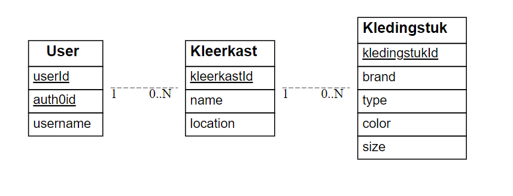

# Where Are My Clothes
API: [API website](https://webservices-louisdegruyter.onrender.com)  
Website: [Online versie](https://wherearemyclothes.onrender.com)
      
## Project Description

A user can add wardrobes and clothing items, and can check in which wardrobe each clothing item is located. For example, it can be used by a student who wants to know which clothes to take to their dorm room.

## Technologies used

The application is built using the following technologies:

- JavaScript
- Koa
- Auth0
- Sequelize

